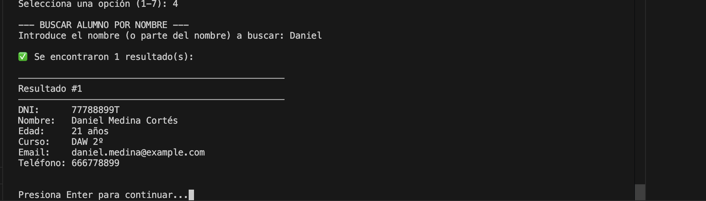

# Sistema de Registro de Alumnos - Academia

**Proyecto 1º Evaluación - Python**  
**Asignatura:** Python  
**Curso:** 2º DAM  
**Autor:** Esteban Garcés / Christian Ballesteros / Alejandro García    
**Fecha:** Noviembre 2025

🔗 **Repositorio GitHub:** [https://github.com/Speeson/Python/tree/master/ActEva03](https://github.com/Speeson/Python/tree/master/ActEva03)

---

## 📑 Índice

1. [Objetivo del Proyecto](#-1-objetivo-del-proyecto)
2. [Estructura del Código](#-2-estructura-del-código)
3. [Funcionamiento del Sistema](#-3-funcionamiento-del-sistema)
4. [Capturas del Funcionamiento](#-4-capturas-del-funcionamiento)
5. [Conclusión Personal](#-5-conclusión-personal)
6. [Instrucciones de Uso](#-6-instrucciones-de-uso)
7. [Repositorio en GitHub](#-7-repositorio-en-github)

---

## 🎯 1. Objetivo del Proyecto

El objetivo de este proyecto es desarrollar un **sistema básico de registro de alumnos** para una academia, implementando operaciones CRUD (Crear, Leer, Actualizar, Eliminar) mediante estructuras de datos nativas de Python. 

### Funcionalidades Principales

El sistema permite:

- ✅ **Almacenar** información detallada de alumnos
- ✅ **Buscar** alumnos por DNI o nombre
- ✅ **Visualizar** listados completos de todos los registros
- ✅ **Eliminar** registros de forma segura con confirmación
- ✅ **Consultar estadísticas** del sistema (edad promedio, distribución por cursos, etc.)

### Requisitos Cumplidos

- ✅ Uso de **listas y diccionarios** como estructuras de datos principales
- ✅ Implementación de **funciones** modulares y reutilizables
- ✅ Uso de **condicionales y bucles** para control de flujo
- ✅ **Validaciones** exhaustivas de datos de entrada
- ✅ **Comentarios PEP8** en todo el código
- ✅ Código **funcional y sin errores**

---

## 🛠️ 2. Estructura del Código

### 2.1 Tecnologías y Lenguajes

- **Lenguaje:** Python 3.x
- **Paradigma:** Programación procedural con funciones
- **Estructuras de datos:** Listas y diccionarios nativos de Python
- **Estándar de código:** PEP8

### 2.2 Estructuras de Datos Utilizadas

#### Lista Principal
```python
alumnos = []  # Lista que almacena todos los registros
```

La lista `alumnos` es la estructura principal que contiene todos los registros. Es una lista global accesible desde todas las funciones del programa.

#### Estructura de Cada Alumno (Diccionario)
```python
alumno = {
    'dni': str,        # Identificador único (formato: 12345678A)
    'nombre': str,     # Nombre completo del alumno
    'edad': int,       # Edad en años (validada entre 1-120)
    'curso': str,      # Curso en el que está matriculado
    'email': str,      # Correo electrónico (opcional)
    'telefono': str    # Número de contacto (opcional)
}
```

Cada alumno se representa como un **diccionario** con 6 campos. Esta estructura permite:
- Acceso rápido a los datos mediante claves descriptivas
- Flexibilidad para añadir campos opcionales
- Legibilidad y mantenibilidad del código

### 2.3 Funciones Implementadas

El código está organizado en **11 funciones principales**, cada una con una responsabilidad específica:

#### **Funciones de Interfaz (2)**

**1. `mostrar_menu()`**
- **Propósito:** Muestra el menú principal del sistema
- **Retorno:** None
- **Descripción:** Presenta las 7 opciones disponibles con formato estructurado

**2. `main()`**
- **Propósito:** Controla el flujo principal del programa
- **Retorno:** None
- **Descripción:** Ejecuta el bucle del menú y gestiona la navegación entre opciones

#### **Funciones de Validación (3)**

**3. `validar_dni(dni)`**
- **Propósito:** Valida el formato de un DNI español
- **Parámetros:** `dni` (str) - DNI a validar
- **Retorno:** bool (True si es válido, False en caso contrario)
- **Validaciones:**
  - Longitud de 9 caracteres
  - Primeros 8 caracteres son dígitos
  - Último carácter es una letra

**4. `validar_edad(edad)`**
- **Propósito:** Verifica que la edad sea un número válido
- **Parámetros:** `edad` (str) - Edad a validar
- **Retorno:** bool (True si está entre 1-120, False en caso contrario)
- **Validaciones:**
  - Es un número entero
  - Está dentro del rango 1-120 años

**5. `dni_existe(dni)`**
- **Propósito:** Comprueba si un DNI ya está registrado
- **Parámetros:** `dni` (str) - DNI a verificar
- **Retorno:** bool (True si existe, False en caso contrario)
- **Descripción:** Previene la inserción de DNIs duplicados

#### **Funciones de Gestión (6)**

**6. `anadir_alumno()`**
- **Propósito:** Registra un nuevo alumno en el sistema
- **Validaciones implementadas:**
  - DNI con formato correcto
  - DNI no duplicado
  - Nombre mínimo 3 caracteres
  - Edad válida
  - Curso mínimo 3 caracteres
- **Descripción:** Solicita datos al usuario, los valida y añade el alumno a la lista

**7. `mostrar_alumnos()`**
- **Propósito:** Lista todos los alumnos registrados
- **Formato:** Muestra cada alumno con todos sus datos en un formato estructurado
- **Descripción:** Itera sobre la lista de alumnos y presenta la información de forma legible

**8. `buscar_alumno_por_dni()`**
- **Propósito:** Busca un alumno específico por su DNI
- **Tipo de búsqueda:** Exacta (coincidencia completa)
- **Descripción:** Recorre la lista hasta encontrar el DNI solicitado

**9. `buscar_alumno_por_nombre()`**
- **Propósito:** Busca alumnos cuyo nombre contenga el texto ingresado
- **Tipo de búsqueda:** Flexible (coincidencia parcial, insensible a mayúsculas)
- **Descripción:** Puede devolver múltiples resultados si varios nombres coinciden

**10. `eliminar_alumno()`**
- **Propósito:** Elimina un alumno del sistema
- **Seguridad:** Solicita confirmación antes de eliminar
- **Descripción:** Busca por DNI, muestra los datos y pide confirmación

**11. `mostrar_estadisticas()`**
- **Propósito:** Calcula y muestra métricas del sistema
- **Estadísticas mostradas:**
  - Total de alumnos registrados
  - Edad promedio, mínima y máxima
  - Curso más popular
  - Distribución de alumnos por curso
- **Descripción:** Procesa todos los alumnos y genera un resumen estadístico

### 2.4 Características del Código

#### **Validaciones Exhaustivas**
- DNI con formato español estándar (8 dígitos + letra)
- Prevención de DNIs duplicados
- Verificación de edades dentro de rangos razonables
- Campos obligatorios con longitud mínima
- Mensajes de error claros e informativos

#### **Modularidad**
- Funciones independientes y reutilizables
- Separación de responsabilidades (validación, presentación, lógica)
- Fácil mantenimiento y extensión

#### **Documentación**
- Docstrings en todas las funciones según PEP8
- Comentarios explicativos en lógica compleja
- Nombres de variables descriptivos

#### **Experiencia de Usuario**
- Menú intuitivo con opciones numeradas
- Mensajes con emojis para mejor visualización (✅, ❌, ⚠️)
- Separadores visuales para organizar la información
- Confirmaciones en operaciones críticas
- Pausas para leer resultados

---

## 📊 3. Funcionamiento del Sistema

### 3.1 Flujo Principal del Programa

```
┌─────────────────────────────────────┐
│   Inicio del Programa               │
└────────────┬────────────────────────┘
             │
             ▼
┌─────────────────────────────────────┐
│   Mostrar Menú Principal            │
│   (7 opciones disponibles)          │
└────────────┬────────────────────────┘
             │
             ▼
┌─────────────────────────────────────┐
│   Usuario selecciona opción         │
└────────────┬────────────────────────┘
             │
             ▼
┌─────────────────────────────────────┐
│   Ejecutar función correspondiente  │
│   (añadir, buscar, mostrar, etc.)   │
└────────────┬────────────────────────┘
             │
             ▼
┌─────────────────────────────────────┐
│   Mostrar resultados al usuario     │
└────────────┬────────────────────────┘
             │
             ▼
┌─────────────────────────────────────┐
│   Pausa (Enter para continuar)      │
└────────────┬────────────────────────┘
             │
             ▼
┌─────────────────────────────────────┐
│   ¿Usuario seleccionó Salir?        │
│         │              │             │
│        No             Sí             │
│         │              │             │
│         └──────────────┘             │
│                │                     │
│       Volver al Menú                 │
│                │                     │
│                ▼                     │
│         Fin del Programa             │
└─────────────────────────────────────┘
```

### 3.2 Menú de Opciones

| Opción | Función | Descripción Detallada |
|--------|---------|----------------------|
| **1** | Añadir alumno | Solicita todos los datos, valida el DNI (formato y duplicados), edad, nombre y curso. Añade el alumno a la lista si todo es correcto. |
| **2** | Mostrar todos | Muestra la lista completa de alumnos con formato estructurado, incluyendo contador total. Si no hay alumnos, informa al usuario. |
| **3** | Buscar por DNI | Solicita un DNI y busca coincidencia exacta. Muestra todos los datos del alumno si lo encuentra, o mensaje de error si no existe. |
| **4** | Buscar por nombre | Solicita un texto y busca coincidencias parciales en los nombres (insensible a mayúsculas). Puede mostrar múltiples resultados. |
| **5** | Eliminar alumno | Busca por DNI, muestra los datos del alumno encontrado y solicita confirmación (S/N) antes de eliminar definitivamente. |
| **6** | Estadísticas | Calcula y muestra: total de alumnos, edad promedio/mínima/máxima, curso más popular y distribución completa por cursos. |
| **7** | Salir | Muestra mensaje de despedida y finaliza el programa de forma ordenada. |

### 3.3 Ejemplos de Uso

#### **Ejemplo 1: Añadir un Alumno (Exitoso)**
```
Usuario: Selecciona opción 1
Sistema: Solicita DNI
Usuario: Ingresa "12345678A"
Sistema: ✅ DNI válido
Sistema: Solicita nombre
Usuario: Ingresa "María González Pérez"
Sistema: ✅ Nombre válido
Sistema: Solicita edad
Usuario: Ingresa "22"
Sistema: ✅ Edad válida
Sistema: Solicita curso
Usuario: Ingresa "DAM 2º"
Sistema: ✅ Curso válido
Sistema: Solicita email (opcional)
Usuario: Ingresa "maria@example.com"
Sistema: Solicita teléfono (opcional)
Usuario: Ingresa "600111222"
Sistema: ✅ "Alumno María González Pérez registrado correctamente con DNI 12345678A"
```

#### **Ejemplo 2: Validación de Error (DNI Duplicado)**
```
Usuario: Selecciona opción 1
Sistema: Solicita DNI
Usuario: Ingresa "12345678A" (ya existe)
Sistema: ❌ "Error: Este DNI ya está registrado en el sistema"
Sistema: Cancela la operación y vuelve al menú
```

#### **Ejemplo 3: Búsqueda por Nombre con Múltiples Resultados**
```
Usuario: Selecciona opción 4
Sistema: Solicita nombre o parte del nombre
Usuario: Ingresa "lópez"
Sistema: ✅ "Se encontraron 2 resultado(s):"
Sistema: Muestra:
  - Ana Martínez López (DNI: 11223344C)
  - David López Moreno (DNI: 44455566F)
```

### 3.4 Conceptos de Python Aplicados

#### **Estructuras de Datos**
- **Listas (`list`)**: Almacenamiento ordenado y mutable de múltiples alumnos
- **Diccionarios (`dict`)**: Representación de cada alumno con pares clave-valor
- **Strings (`str`)**: Manipulación de texto para nombres, DNIs, etc.

#### **Control de Flujo**
- **Bucles `while`**: Menú principal y validaciones iterativas hasta entrada correcta
- **Bucles `for`**: Iteración sobre la lista de alumnos para búsquedas y visualización
- **Condicionales `if/elif/else`**: Toma de decisiones y validaciones

#### **Funciones y Modularización**
- **Definición de funciones**: `def nombre_funcion(parametros):`
- **Docstrings**: Documentación integrada en cada función
- **Parámetros y retorno**: Paso de información entre funciones

#### **Métodos de String**
- `.strip()`: Elimina espacios al inicio y final
- `.upper()`: Convierte a mayúsculas (para DNI)
- `.lower()`: Convierte a minúsculas (para búsquedas)
- `.isdigit()`: Verifica si son dígitos
- `.isalpha()`: Verifica si son letras
- `in`: Operador para búsqueda de subcadenas

#### **Operaciones con Listas**
- `.append()`: Añade elementos al final
- `.pop(index)`: Elimina elemento por índice
- `len()`: Obtiene la longitud
- `enumerate()`: Itera con índice y valor

#### **Funciones Agregadas**
- `sum()`: Suma de elementos de una lista
- `min()` / `max()`: Valores mínimos y máximos
- List comprehension: `[alumno['edad'] for alumno in alumnos]`

---

## 📸 4. Capturas del Funcionamiento

A continuación se muestran capturas de pantalla del sistema en ejecución, demostrando todas las funcionalidades principales.

### 4.1 Menú Principal


**Descripción:** Interfaz principal del sistema mostrando las 7 opciones disponibles. El menú está estructurado con separadores visuales para mejor legibilidad. Se muestra el mensaje de bienvenida y las opciones numeradas del 1 al 7.

---

### 4.2 Añadir Nuevo Alumno - Proceso Exitoso


**Descripción:** Proceso completo de registro de un nuevo alumno. Se solicitan todos los campos (DNI, nombre, edad, curso, email, teléfono), se validan los datos ingresados y se muestra el mensaje de confirmación ✅ "Alumno registrado correctamente".

**Datos del ejemplo:**
- DNI: 12345678A
- Nombre: María González Pérez
- Edad: 22 años
- Curso: DAM 2º

---

### 4.3 Añadir Alumno - Error de Validación


**Descripción:** Demostración del sistema de validación. Se muestra un error cuando se intenta:
- Registrar un DNI con formato incorrecto (ejemplo: "123" en lugar de "12345678A")
- O registrar un DNI que ya existe en el sistema

El sistema muestra el mensaje de error ❌ correspondiente y solicita ingresar el dato correctamente, sin perder los datos ya ingresados cuando es posible.

---

### 4.4 Mostrar Todos los Alumnos


**Descripción:** Listado completo de todos los alumnos registrados en el sistema. Cada alumno se muestra en un bloque separado con:
- Número de alumno (#1, #2, #3...)
- DNI
- Nombre completo
- Edad
- Curso
- Email
- Teléfono

En la parte superior se indica el total de alumnos registrados. Los separadores visuales (─) organizan la información para facilitar la lectura.

---

### 4.5 Buscar Alumno por DNI


**Descripción:** Búsqueda exitosa de un alumno mediante su DNI. El sistema:
1. Solicita el DNI a buscar
2. Realiza una búsqueda exacta en la lista
3. Muestra todos los datos del alumno encontrado con el mensaje ✅ "ALUMNO ENCONTRADO"

**Ejemplo de búsqueda:** DNI: 12345678A → Encuentra a María González Pérez

---

### 4.6 Buscar Alumno por Nombre



**Descripción:** Búsqueda flexible por nombre que permite coincidencias parciales. El sistema:
1. Solicita el nombre o parte del nombre
2. Busca coincidencias (insensible a mayúsculas/minúsculas)
3. Muestra todos los alumnos que coinciden con el criterio

**Características:**
- Búsqueda parcial: "lópez" encuentra "Ana Martínez López" y "David López Moreno"
- No distingue mayúsculas/minúsculas
- Indica el número de resultados encontrados
- Muestra cada resultado numerado con todos sus datos

---

### 4.7 Estadísticas del Sistema


**Descripción:** Panel de estadísticas del sistema que muestra métricas calculadas dinámicamente:

**Información mostrada:**
- Total de alumnos registrados
- Edad promedio (con 1 decimal)
- Edad mínima
- Edad máxima
- Curso más popular (con número de alumnos)
- Distribución completa de alumnos por curso

**Ejemplo con 20 alumnos:**
- Total: 20 alumnos
- Edad promedio: 21.9 años
- Rango de edades: 19-26 años
- Curso más popular: Python Avanzado (6 alumnos)
- Distribución: DAM 1º (4), DAM 2º (5), DAW 2º (5), Python Avanzado (6)

---

### 4.8 Eliminar Alumno


**Descripción:** Proceso de eliminación de un alumno con confirmación de seguridad. El sistema:
1. Solicita el DNI del alumno a eliminar
2. Busca el alumno y muestra sus datos principales (nombre, DNI, curso)
3. Solicita confirmación explícita (S/N)
4. Si el usuario confirma con "S", elimina el alumno y muestra mensaje ✅
5. Si el usuario ingresa "N", cancela la operación ❌

Esta funcionalidad previene eliminaciones accidentales mediante el sistema de confirmación.

---

### 4.9 Validación - DNI Duplicado


**Descripción:** Demostración de la validación que previene DNIs duplicados. Cuando se intenta registrar un alumno con un DNI que ya existe en el sistema:
1. El sistema verifica la existencia del DNI antes de solicitar más datos
2. Muestra el mensaje de error ❌ "Error: Este DNI ya está registrado en el sistema"
3. Cancela la operación sin añadir el alumno
4. Vuelve al menú principal

Esta validación mantiene la integridad de los datos y asegura que cada DNI sea único.

---

### 4.10 Búsqueda sin Resultados


**Descripción:** Comportamiento del sistema cuando una búsqueda no encuentra coincidencias. Se muestra el mensaje ❌ "No se encontró ningún alumno con [criterio]" o "No se encontraron alumnos con '[texto]' en su nombre".

Esto ayuda al usuario a confirmar que la búsqueda se realizó correctamente pero no hay coincidencias, diferenciándolo de un error del sistema.

---

## 💡 5. Conclusión Personal

### 5.1 Aprendizajes Principales

Este proyecto ha sido fundamental para consolidar mis conocimientos de Python y entender cómo aplicar conceptos teóricos en un sistema real y funcional.

#### **1. Estructuras de Datos**
El aprendizaje más importante ha sido comprender cómo elegir y combinar estructuras de datos apropiadas. Utilizar una **lista de diccionarios** resultó ser la solución perfecta:
- La lista permite gestionar múltiples alumnos de manera ordenada
- Los diccionarios proporcionan una forma clara y legible de representar los atributos de cada alumno
- Esta combinación facilita tanto el almacenamiento como la búsqueda de información

**Ejemplo práctico:** 
```python
# Acceder al nombre del primer alumno
nombre = alumnos[0]['nombre']

# Buscar todos los alumnos de DAM 2º
alumnos_dam = [a for a in alumnos if a['curso'] == 'DAM 2º']
```

#### **2. Validación de Datos**
Implementar validaciones exhaustivas me ha enseñado la importancia de la robustez en las aplicaciones:
- La validación del DNI previene errores de formato
- Comprobar duplicados evita inconsistencias en los datos
- Las validaciones de edad y longitud de texto mejoran la calidad de los datos almacenados
- Los mensajes de error claros mejoran significativamente la experiencia del usuario

**Lección aprendida:** Es mejor invertir tiempo en validaciones al inicio que tener que corregir datos incorrectos después.

#### **3. Modularización del Código**
Organizar el código en funciones específicas ha demostrado múltiples ventajas:
- **Reutilización**: `validar_dni()` se puede usar en diferentes contextos
- **Mantenibilidad**: Es más fácil localizar y corregir errores
- **Legibilidad**: El código es más fácil de entender y documentar
- **Testing**: Cada función puede probarse de forma independiente

**Comparación:**
```python
# ❌ Código sin modularizar (difícil de mantener)
# Todo el código de validación repetido en cada función

# ✅ Código modularizado (reutilizable)
if not validar_dni(dni):
    print("Error...")
```

#### **4. Experiencia de Usuario**
Aunque es una interfaz de texto, aprendí que pequeños detalles marcan la diferencia:
- Los separadores visuales (`─`) organizan la información
- Los emojis (✅, ❌, ⚠️) hacen el sistema más intuitivo
- Las confirmaciones previenen acciones no deseadas
- Los mensajes informativos guían al usuario en cada paso

**Reflexión:** Un buen programa no solo funciona correctamente, sino que es agradable de usar.

#### **5. Estándares de Código (PEP8)**
Seguir las convenciones de Python ha mejorado la calidad del código:
- Los docstrings facilitan la comprensión de cada función
- La nomenclatura consistente hace el código más profesional
- Los comentarios bien ubicados explican la lógica compleja
- El espaciado adecuado mejora la legibilidad

### 5.2 Desafíos Encontrados y Soluciones

#### **Desafío 1: Validación de DNI**
**Problema:** Inicialmente, la validación del DNI era demasiado simple y permitía formatos incorrectos.

**Solución:** Implementé una función específica que verifica:
- Longitud exacta de 9 caracteres
- Los primeros 8 son dígitos
- El último es una letra

```python
def validar_dni(dni):
    dni = dni.strip().upper()
    if len(dni) != 9:
        return False
    if not dni[:8].isdigit():
        return False
    if not dni[8].isalpha():
        return False
    return True
```

#### **Desafío 2: Búsqueda Flexible por Nombre**
**Problema:** La búsqueda por nombre solo encontraba coincidencias exactas, lo cual era muy limitante.

**Solución:** Utilicé `.lower()` para hacer la búsqueda insensible a mayúsculas y el operador `in` para permitir coincidencias parciales:
```python
if nombre_buscar.lower() in alumno['nombre'].lower():
    resultados.append(alumno)
```

Esto permite que "maría", "María" o "MARÍA" encuentren a "María González Pérez".

#### **Desafío 3: Prevención de DNIs Duplicados**
**Problema:** El sistema permitía registrar el mismo DNI múltiples veces, causando inconsistencias.

**Solución:** Creé la función `dni_existe()` que verifica antes de añadir:
```python
if dni_existe(dni):
    print("❌ Error: Este DNI ya está registrado")
    return
```

#### **Desafío 4: Cálculo de Estadísticas**
**Problema:** Calcular estadísticas como edad promedio y curso más popular requería procesar toda la lista.

**Solución:** Utilicé funciones agregadas de Python y comprensión de listas:
```python
# Edad promedio
suma_edades = sum(alumno['edad'] for alumno in alumnos)
edad_promedio = suma_edades / len(alumnos)

# Curso más popular
curso_popular = max(cursos, key=cursos.get)
```

### 5.3 Comparación con Tecnologías de DAM

Este proyecto en Python me ha permitido contrastar con lo que he aprendido en Java:

| Aspecto | Python | Java (en DAM) |
|---------|--------|---------------|
| **Sintaxis** | Más concisa y legible | Más verbosa pero tipada estáticamente |
| **Estructuras de datos** | Listas y dicts nativos | ArrayList, HashMap con tipos genéricos |
| **Validación** | Manual con try/except | Sistema de tipos + excepciones checked |
| **Desarrollo** | Más rápido para prototipos | Más estructurado y escalable |
| **Documentación** | Docstrings flexibles | Javadoc con formato estricto |

**Reflexión:** Ambos lenguajes tienen sus fortalezas. Python es excelente para desarrollo rápido y scripts, mientras que Java brilla en aplicaciones grandes y empresariales.

### 5.4 Aplicabilidad en Otras Asignaturas de DAM

Los conceptos aplicados en este proyecto son directamente transferibles a otras asignaturas:

#### **Acceso a Datos**
- Base de datos relacional: Migrar la lista a SQLite/MySQL
- ORM: Usar SQLAlchemy para mapear el diccionario a una tabla
- CRUD: Las operaciones ya están implementadas, solo cambiar el almacenamiento

#### **Desarrollo de Interfaces**
- La lógica de negocio está separada, facilitando añadir una GUI
- Tkinter: Crear ventanas para cada funcionalidad
- JavaFX/Android: Misma lógica, diferente presentación

#### **Programación de Servicios y Procesos**
- API REST: Convertir las funciones en endpoints con Flask/FastAPI
- Concurrencia: Gestionar múltiples usuarios simultáneos
- Microservicios: Separar validaciones, búsquedas y estadísticas

#### **Aplicaciones Móviles (Kotlin/Android)**
- La estructura de datos es similar a Room/SQLite
- Las validaciones son aplicables en formularios móviles
- La lógica CRUD es la misma, solo cambia la UI

### 5.5 Aspectos Positivos del Proyecto

✅ **Funcionalidad completa:** El código cumple todos los requisitos y funciona sin errores  
✅ **Validaciones robustas:** El sistema previene entradas incorrectas de múltiples formas  
✅ **Código limpio:** Estructura modular que facilita mantenimiento  
✅ **Interfaz intuitiva:** Mensajes claros y navegación sencilla  
✅ **Estándares profesionales:** Sigue PEP8 y buenas prácticas  
✅ **Extensibilidad:** Fácil añadir nuevas funcionalidades  

### 5.6 Aspectos a Mejorar

⚠️ **Persistencia de datos:** Actualmente los datos se pierden al cerrar el programa. Sería ideal implementar guardado en JSON o CSV.

⚠️ **Validaciones avanzadas:** Email y teléfono aceptan cualquier texto. Se podrían usar expresiones regulares para validar formatos correctos.

⚠️ **Edición de datos:** Falta la funcionalidad para modificar alumnos existentes (solo se pueden añadir o eliminar).

⚠️ **Manejo de excepciones:** No hay try/except en todas las funciones. Aunque las validaciones previenen la mayoría de errores, sería más robusto añadirlos.

⚠️ **Programación Orientada a Objetos:** El proyecto usa paradigma procedural. Una clase `Alumno` y otra `GestorAlumnos` serían más escalables.

### 5.7 Mejoras Futuras Propuestas

#### **Corto Plazo (1-2 semanas)**
1. **Persistencia en JSON:** Guardar/cargar datos automáticamente
   ```python
   import json
   with open('alumnos.json', 'w') as f:
       json.dump(alumnos, f)
   ```

2. **Función de edición:** Permitir modificar datos de alumnos existentes

3. **Validación de email con regex:**
   ```python
   import re
   patron = r'^[\w\.-]+@[\w\.-]+\.\w+$'
   if not re.match(patron, email):
       print("Email inválido")
   ```

#### **Medio Plazo (1 mes)**
1. **Migración a SQLite:** Base de datos persistente y consultas SQL
2. **Interfaz gráfica con Tkinter:** Ventanas, botones y formularios
3. **Exportación de reportes:** Generar PDF con la lista de alumnos
4. **Sistema de notas:** Añadir calificaciones a cada alumno

#### **Largo Plazo (2-3 meses)**
1. **API REST con Flask:** Convertir en servicio web
2. **Aplicación móvil:** Cliente Android/iOS que consuma la API
3. **Autenticación:** Sistema de usuarios (admin, profesor, alumno)
4. **Múltiples academias:** Gestionar varias sedes desde una aplicación

### 5.8 Reflexión Final

Este proyecto ha sido fundamental para consolidar mis conocimientos de Python y entender cómo aplicar conceptos teóricos en un sistema real. La experiencia de crear una aplicación completa desde cero, con validaciones, interfaz de usuario y diferentes funcionalidades, me ha dado confianza para enfrentar proyectos más complejos.

**Lo más valioso que he aprendido** es que un buen código no solo es el que funciona, sino el que:
- ✅ Es fácil de leer y mantener
- ✅ Está bien documentado
- ✅ Maneja errores apropiadamente
- ✅ Piensa en la experiencia del usuario
- ✅ Sigue estándares de la industria

Estos principios son aplicables a cualquier lenguaje de programación y serán fundamentales en mi desarrollo como programador profesional. El proyecto me ha preparado para las siguientes asignaturas de DAM y para futuros proyectos personales o profesionales.

**Valoración personal:** ⭐⭐⭐⭐⭐ (5/5)  
**Dificultad:** Media  
**Tiempo invertido:** ~6-8 horas  
**Satisfacción con el resultado:** Muy alta

---

## 🚀 6. Instrucciones de Uso

### 6.1 Requisitos del Sistema

- **Python:** Versión 3.6 o superior
- **Sistema Operativo:** Windows, Linux o macOS
- **Dependencias:** Ninguna (solo usa bibliotecas estándar de Python)

### 6.2 Archivos del Proyecto

El proyecto incluye **2 versiones** del programa:

1. **`registro_alumnos.py`** - Versión limpia sin datos pre-cargados (lista vacía)
2. **`registro_alumnos_ejemplos.py`** - ⭐ Versión con 20 alumnos de prueba (**RECOMENDADA** para demostraciones)

### 6.3 Ejecución del Programa

#### **Opción 1: Empezar desde cero**
```bash
python registro_alumnos.py
```

#### **Opción 2: Con 20 alumnos de prueba (RECOMENDADO)**
```bash
python registro_alumnos_ejemplos.py
```

En algunos sistemas, usar `python3` en lugar de `python`:
```bash
python3 registro_alumnos_ejemplos.py
```

### 6.4 Navegación

1. Ejecutar el programa
2. Leer el menú presentado
3. Ingresar el número de la opción deseada (1-7)
4. Seguir las instrucciones en pantalla
5. Presionar Enter para volver al menú después de cada operación

### 6.5 Datos de Prueba Disponibles

#### **Lista de 20 Alumnos (en `registro_alumnos_ejemplos.py`)**

El programa con 20 alumnos incluye datos realistas con la siguiente distribución:

**Estadísticas:**
- Total: 20 alumnos
- Edad promedio: 21.9 años
- Rango de edades: 19-26 años

**Distribución por cursos:**
- DAM 1º: 4 alumnos
- DAM 2º: 5 alumnos
- DAW 2º: 5 alumnos
- Python Avanzado: 6 alumnos (el más popular)

**Ejemplos de alumnos incluidos:**

| DNI | Nombre | Edad | Curso |
|-----|--------|------|-------|
| 12345678A | María González Pérez | 22 | DAM 2º |
| 87654321B | Carlos Rodríguez Sánchez | 20 | Python Avanzado |
| 11223344C | Ana Martínez López | 24 | DAM 2º |
| 99887766D | Juan Pérez García | 19 | Python Avanzado |
| 55566677E | Laura Fernández Ruiz | 23 | DAW 2º |

### 6.6 Casos de Prueba Recomendados

#### **Para probar búsqueda por DNI:**
- `12345678A` → María González Pérez
- `77788899J` → Javier Morales Ortiz (26 años, el alumno de mayor edad)
- `88899900K` → Lucía Romero Navarro (19 años, la alumna más joven)

#### **Para probar búsqueda por nombre (múltiples resultados):**
- `lópez` → Encuentra 2 alumnos (Ana Martínez López y David López Moreno)
- `castro` → Encuentra 2 alumnos (Isabel Ramírez Castro y Sergio Castro Herrera)
- `maría` → Encuentra 1 alumno (María González Pérez)

#### **Para probar estadísticas:**
- Ejecutar opción 6 con los 20 alumnos pre-cargados
- Observar el curso más popular (Python Avanzado con 6 alumnos)
- Verificar la distribución por cursos

#### **Para probar eliminación:**
- DNI de prueba: `77788899T` (Daniel Medina Cortés)
- Verificar que el total baje de 20 a 19 alumnos

### 6.7 Estructura de Entrega

```
proyecto_registro_alumnos/
│
├── registro_alumnos.py              # Programa principal (SIN datos)
├── registro_alumnos_ejemplos.py     # Programa con 20 alumnos
│
├── README.md                        # Este documento (informe completo)
│
└── capturas/                        # Carpeta con capturas de pantalla
    ├── 01_menu_principal.png
    ├── 02_anadir_alumno_exito.png
    ├── 03_anadir_alumno_error.png
    ├── 04_mostrar_todos.png
    ├── 05_buscar_dni.png
    ├── 06_buscar_nombre.png
    ├── 07_estadisticas.png
    ├── 08_eliminar_alumno.png
    ├── 09_error_dni_duplicado.png
    └── 10_busqueda_sin_resultados.png
```

### 6.8 Solución de Problemas Comunes

#### **Problema: "Python no se reconoce como comando"**
**Solución:** Asegúrate de que Python esté instalado y añadido al PATH del sistema. Intenta usar `python3` en lugar de `python`.

#### **Problema: "El programa se cierra inmediatamente"**
**Solución:** Ejecuta el programa desde la terminal/línea de comandos, no haciendo doble clic en el archivo.

#### **Problema: "No puedo ver los emojis correctamente"**
**Solución:** Algunos terminales antiguos no soportan emojis. El programa funciona igual, solo que verás caracteres extraños en lugar de ✅ ❌ ⚠️.

---

## 🔗 7. Repositorio en GitHub

### 7.1 Enlace al Repositorio

Este proyecto está alojado en GitHub para facilitar el acceso, la colaboración y el control de versiones:

**📦 Repositorio:** [https://github.com/Speeson/Python/tree/master/ActEva03](https://github.com/Speeson/Python/tree/master/ActEva03)

### 7.2 Estructura del Repositorio

```
ActEva03/
│
├── registro_alumnos.py              # Programa principal sin datos
├── registro_alumnos_ejemplos.py     # Programa con 20 alumnos
│
├── capturas/                        # Capturas de pantalla
│   ├── 01_menu_principal.png
│   ├── 02_anadir_alumno_exito.png
│   ├── 03_anadir_alumno_error.png
│   ├── 04_mostrar_todos.png
│   ├── 05_buscar_dni.png
│   ├── 06_buscar_nombre.png
│   ├── 07_estadisticas.png
│   ├── 08_eliminar_alumno.png
│   ├── 09_error_dni_duplicado.png
│   └── 10_busqueda_sin_resultados.png
│
└── README.md                        # Este documento (informe completo)
```

### 7.3 Cómo Clonar el Repositorio

Para obtener una copia local del proyecto:

```bash
# Clonar el repositorio completo
git clone https://github.com/Speeson/Python.git

# Navegar a la carpeta del proyecto
cd Python/ActEva03

# Ejecutar el programa
python registro_alumnos_ejemplos.py
```

### 7.4 Ventajas de Usar GitHub

✅ **Control de versiones** - Historial completo de cambios  
✅ **Acceso desde cualquier lugar** - Disponible online 24/7  
✅ **Respaldo automático** - Los datos están seguros en la nube  
✅ **Colaboración** - Fácil compartir con compañeros o profesores  
✅ **Portafolio** - Demuestra habilidades de programación  
✅ **Buenas prácticas** - Aprendizaje de herramientas profesionales  

### 7.5 Commits Realizados

El proyecto incluye commits organizados que documentan el desarrollo:

- `Initial commit` - Estructura básica del proyecto
- `Add main program` - Implementación de las funciones principales
- `Add data validation` - Sistema de validaciones completo
- `Add 20 test students` - Datos de prueba pre-cargados
- `Add documentation` - README completo con informe
- `Add screenshots` - Capturas del funcionamiento del sistema

### 7.6 Información Adicional en GitHub

En el repositorio puedes encontrar:

- 📄 **README.md** - Este documento completo con el informe
- 💻 **Código fuente** - Todas las versiones del programa
- 📸 **Capturas** - Screenshots del sistema en funcionamiento
- 📚 **Documentación extra** - Guías y listas de datos
- 🔄 **Historial** - Evolución del proyecto con commits
- ⭐ **Issues** - Para reportar bugs o sugerir mejoras (si aplica)

### 7.7 Tecnologías y Herramientas

El proyecto utiliza:

- **Lenguaje:** Python 3.x
- **Control de versiones:** Git
- **Plataforma:** GitHub
- **Documentación:** Markdown
- **IDE recomendado:** Visual Studio Code

### 7.8 Licencia

Este proyecto ha sido desarrollado con fines educativos para la asignatura de Python en 2º DAM.

---

## 📚 Referencias

- [Documentación oficial de Python](https://docs.python.org/es/3/)
- [PEP 8 – Style Guide for Python Code](https://pep8.org/)
- [Real Python - Python Data Structures](https://realpython.com/python-data-structures/)
- [Python Tutorial - Functions](https://docs.python.org/3/tutorial/controlflow.html#defining-functions)
- Apuntes de clase de Python - 2º DAM

---

## 📄 Información del Proyecto

- **Asignatura:** Python
- **Curso:** 2º Desarrollo de Aplicaciones Multiplataforma (DAM)
- **Evaluación:** 1º Evaluación
- **Autor:** Esteban Garcés / Christian Ballesteros / Alejandro García
- **Fecha de entrega:** Noviembre 2025
- **Versión del código:** 1.0
- **Repositorio GitHub:** [https://github.com/Speeson/Python/tree/master/ActEva03](https://github.com/Speeson/Python/tree/master/ActEva03)

---

**© 2025 - Proyecto desarrollado por Entornito para la asignatura de Python, 2º DAM**
